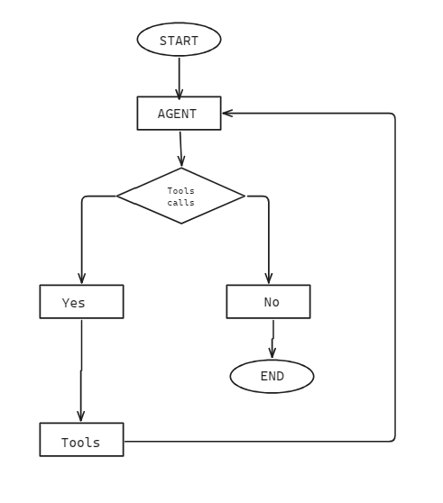

# HCP CRM - Log Interaction Module

This project is my implementation of the **Log Interaction Screen** for an AI-first Healthcare CRM.

The application allows a medical representative to record interactions with Healthcare Professionals (HCPs). Users can either fill a normal form or simply chat with the AI assistant. Both methods create the same interaction record.

---

## Project Structure

```
hcp-crm/
├── backend/
├── frontend/
└── README.md
```

---

# Project Overview

The purpose of this project is to make interaction logging easier.

Instead of filling every field manually, the representative can simply describe the meeting. The AI understands the conversation, extracts important details, and automatically fills the interaction form.

The user can always review and edit the information before saving it.

There are two ways to log an interaction.

### 1. Form Based Logging

The user manually fills information like:

- HCP Name
- Interaction Type
- Date & Time
- Attendees
- Topics Discussed
- Materials Shared
- Samples Distributed
- Sentiment
- Outcomes
- Follow-up Actions

### 2. AI Chat Logging

Instead of filling the form, the user can simply type something like:

```text
Met Dr. Sharma today, discussed Product X efficacy data, she was positive about it, I left a brochure and 2 samples, she wants a follow-up in 2 weeks.
```

The AI automatically extracts the important information and fills the form.

---

# LangGraph Workflow

The AI assistant is built using LangGraph.

The workflow is simple.

1. User sends a message.
2. LangGraph understands the request.
3. Required tools are executed.
4. Database is updated.
5. AI sends the response.
6. The interaction form is updated automatically.



---

# LangGraph Tools

The project uses six tools.

## 1. Log Interaction

Creates a new interaction record.

### Example

```text
Met Dr. Sharma today, discussed Product X efficacy data, she was positive about it, I left a brochure and 2 samples, she wants a follow-up in 2 weeks.
```

The AI extracts:

- HCP Name
- Topics Discussed
- Sentiment
- Materials Shared
- Samples Distributed
- Follow-up Actions

and saves everything into the database.

---

## 2. Edit Interaction

Updates an existing interaction.

### Example

```text
Actually, change the sentiment to Negative instead.
```

The AI finds the previous interaction and updates only the sentiment field.

---

## 3. Search HCP History

Searches previous meetings with an HCP.

### Example

```text
I'm heading to see Dr. Sharma again — what did we cover last time?
```

The AI returns previous interaction details to help prepare for the next visit.

---

## 4. Search Materials and Samples

Searches available brochures and samples.

### Example

```text
What materials do we have for Product X?
```

The AI returns matching materials from the database.

---

## 5. Suggest Follow Ups

Generates follow-up recommendations.

### Example

```text
Based on today's meeting with Dr. Sharma, what should my next steps be?
```

Example suggestions:

- Schedule another meeting
- Share additional product information
- Send clinical documents

---


# AI Models Used

This project uses two Groq models.

### gemma2-9b-it

Used as the main model for:

- Understanding user messages
- Calling LangGraph tools
- Extracting structured data
- Generating responses

### llama-3.3-70b-versatile

Used for:

- Voice note summarization
- Follow-up suggestions

---

# Tech Stack

### Frontend

- React
- Redux Toolkit
- Vite

### Backend

- FastAPI
- Python

### AI

- LangGraph
- Groq API

### Database

- MySQL
---

# Running the Project

## Backend

```bash
cd backend

python -m venv .venv

pip install -r requirements.txt

uvicorn app.main:app --reload
```

Add your Groq API key inside the `.env` file.

---

## Frontend

```bash
cd frontend

npm install

npm run dev
```

Open:

```
http://localhost:5173
```

---

# API Endpoints

| Method | Endpoint | Description |
|---------|----------|-------------|
| POST | `/api/interactions` | Create interaction |
| GET | `/api/interactions` | Get all interactions |
| PATCH | `/api/interactions/{id}` | Update interaction |
| DELETE | `/api/interactions/{id}` | Delete interaction |
| GET | `/api/hcps` | Search HCP |
| POST | `/api/chat` | Chat with AI |

---

# Conclusion

This project demonstrates how an AI agent can simplify interaction logging in a Healthcare CRM. Instead of manually filling every field, the representative can simply describe the meeting, and the AI organizes the information into structured data while still allowing manual edits before saving.